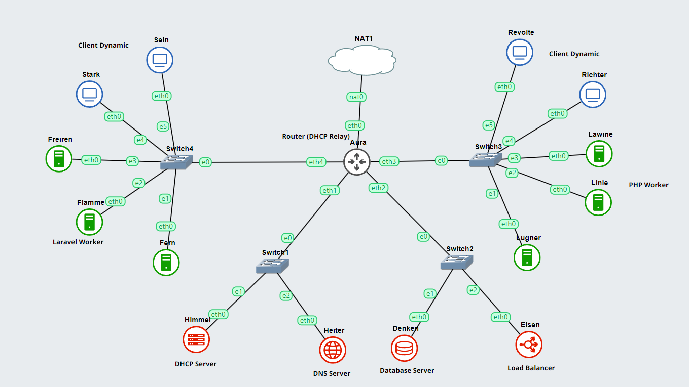

# Jarkom-Modul-3-D05-2023
**Praktikum Jaringan Komputer Modul 3 Tahun 2023**

## Author
| Nama | NRP |Github |
|---------------------------|------------|--------|
|Ihsan Widagdo | 5025211231 | https://github.com/dagdo03 |
|Sandyatama Fransisna Nugraha | 5025211196 | https://github.com/TamaFn | 

# Laporan Resmi 

## Topologi Soal 3



### Panduan Memulai Modul
Langkah pertama adalah menambahkan docker dengan debian sebelum melakukan preference. 


Langkah selanjutnya adalah menyetting debian dengan adapter 5 karena menggunakan 5 lintas arah jaringan


### Sebelum memulai 

Sebelum memulai setting node, konfigurasikan tiap-tiap node dengan ip sebagai berikut 

### Konfigurasi IP Pada Masing" Node 
- **Aura (Router DHCP Relay)**
  ```
  auto eth0
  iface eth0 inet dhcp
  up iptables -t nat -A POSTROUTING -o eth0 -j MASQUERADE -s 10.24.0.0/16

  auto eth1
  iface eth1 inet static
          address 10.24.1.0
          netmask 255.255.255.0

  auto eth2
  iface eth2 inet static
          address 10.24.2.0
          netmask 255.255.255.0

  auto eth3
  iface eth3 inet static
          address 10.24.3.0
          netmask 255.255.255.0

  auto eth4
  iface eth3 inet static
          address 10.24.4.0
          netmask 255.255.255.0
  ```
- **Freiren (Laravel Worker)**
  ```
  auto eth0
  iface eth0 inet static
          address 10.24.4.3
          netmask 255.255.255.0
          gateway 10.24.4.0
          up echo nameserver 192.168.122.1 > /etc/resolv.conf
  ```
- **Flamme (Laravel Worker)**
  ```
  auto eth0
  iface eth0 inet static
          address 10.24.4.2
          netmask 255.255.255.0
          gateway 10.24.4.0
          up echo nameserver 192.168.122.1 > /etc/resolv.conf
  ```
- **Fern (Laravel Worker)**
  ```
  auto eth0
  iface eth0 inet static
          address 10.24.4.1
          netmask 255.255.255.0
          gateway 10.24.4.0
          up echo nameserver 192.168.122.1 > /etc/resolv.conf
  ```
- **Lugner (PHP Worker)**
  ```
  auto eth0
  iface eth0 inet static
          address 10.24.3.1
          netmask 255.255.255.0
          gateway 10.24.3.0
          up echo nameserver 192.168.122.1 > /etc/resolv.conf
  ```

- **Linie (PHP Worker)**
  ```
  auto eth0
  iface eth0 inet static
          address 10.24.3.2
          netmask 255.255.255.0
          gateway 10.24.3.0
          up echo nameserver 192.168.122.1 > /etc/resolv.conf
  ```
- **Lawine (PHP Worker)**
  ```
  auto eth0
  iface eth0 inet static
          address 10.24.3.3
          netmask 255.255.255.0
          gateway 10.24.3.0
          up echo nameserver 192.168.122.1 > /etc/resolv.conf
  ```
- **Stark (Client Dynamic)**
  ```
  auto eth0
  iface eth0 inet dhcp

          
  ```

- **Sein (Client Dynamic)**
  ```
  auto eth0
  iface eth0 inet dhcp

  ```

- **Revolte (Client Dynamic)**
  ```
  auto eth0
  iface eth0 inet dhcp

  ```

- **Richter (Client Dynamic)**
  ```
  auto eth0
  iface eth0 inet dhcp

  ```

- **Himmel (DHCP Server)**
  ```
  auto eth0
  iface eth0 inet static
          address 10.24.1.1
          netmask 255.255.255.0
          gateway 10.24.1.0
  ```

- **Heiter (DNS Server)**
  ```
  auto eth0
  iface eth0 inet static
          address 10.24.1.2
          netmask 255.255.255.0
          gateway 10.24.1.0
  ```

- **Denken (Database Server)**
  ```
  auto eth0
  iface eth0 inet static
          address 10.24.2.1
          netmask 255.255.255.0
          gateway 10.24.2.0
  ```

- **Heiter (Eisen Balancer)**
  ```
  auto eth0
  iface eth0 inet static
          address 10.24.2.2
          netmask 255.255.255.0
          gateway 10.24.2.0
  ```


- **Alamat IP Pada Masing-masing Node**
  ```
  Aura (Router DHCP Relay)    : 10.24.1.0 
  Fern (Laravel Worker)	      : 10.24.4.1
  Flamme (Laravel Worker)     : 10.24.4.2 
  Freiren (Laravel Worker)	  : 10.24.4.3
  Stark (Client Dynamic)	  : 10.24.4.4
  Sein (Client Dynamic)	      : 10.24.4.5
  Lugner (PHP Worker)	      : 10.24.3.1
  Linie (PHP Worker)          : 10.24.3.2
  Lawine (PHP Worker)	      : 10.24.3.3
  Richter (Client Dynamic)	  : 10.24.3.4
  Revolte (Client Dynamic)	  : 10.24.3.5
  Denken (Database Server)    : 10.24.2.1
  Eisen (Load Balancer)       : 10.24.2.2
  Himmel (DHCP Server)        : 10.24.1.1
  Heiter (DNS Serve)          : 10.24.1.2
  ```

Lakukan instalasi setiap node menggunakan  `nano .bashrc` agar tiap node siap melakukan konfigurasi

- **Aura Router(DHCP Relay)**
  ```
  iptables -t nat -A POSTROUTING -o eth0 -j MASQUERADE -s 10.24.0.0/16
  echo nameserver 192.168.122.1 > /etc/resolv.conf
  apt-get update
  apt-get install isc-dhcp-relay -y
  echo 'SERVERS="10.24.1.1"
  INTERFACES="eth1 eth2 eth3 eth4"
  OPTIONS=""
  ' > /etc/default/isc-dhcp-relay
  echo 'net.ipv4.ip_forward=1' > /etc/sysctl.conf
  service isc-dhcp-relay start
  ```
- **Himmel (DHCP Server)**
  ```
  rm /var/run/dhcpd.pid
  echo nameserver 192.168.122.1 > /etc/resolv.conf
  apt-get update
  apt-get install isc-dhcp-server -y
  echo 'DHCPDv4_PID=/var/run/dhcpd.pid
  INTERFACESv4="eth0"' > /etc/default/    isc-dhcp-server

  echo 'subnet 10.24.1.0  netmask 255.255.255.0 {
    
  };      
  subnet 10.24.2.0 netmask 255.255.255.0 {

  };
  subnet 10.24.3.0  netmask 255.255.255.0 {
    range 10.24.3.16 10.24.3.32;
    range 10.24.3.64 10.24.3.80;
    option routers 10.24.3.0;
    option broadcast-address 10.24.3.255;
    option domain-name-servers 10.24.1.2;
    default-lease-time 180;
    max-lease-time 5760;
  };
  subnet 10.24.4.0  netmask 255.255.255.0 {
    range 10.24.4.12 10.24.4.20;
    range 10.24.4.160 10.24.4.168;
    option routers 10.24.4.0;
    option broadcast-address 10.24.4.255;
    option domain-name-servers 10.24.1.2;
    default-lease-time 720;
    max-lease-time 5760; 
  };' > /etc/dhcp/dhcpd.conf

  service isc-dhcp-server start
  ```
- **Heiter (DNS Server)**
  ```
  echo 'nameserver 192.168.122.1' > /etc/resolv.conf
  apt-get update
  apt-get install bind9 -y

  echo 'options {
        directory "/var/cache/bind";
        forwarders{
                192.168.122.1;
        };
        allow-query{any;};
        auth-nxdomain no;    # conform to RFC1035
        listen-on-v6 { any; };
  };' > /etc/bind/named.conf.options

  echo 'zone "riegel.canyon.d05.com"{  
        type master;
        file "/etc/bind/jarkom/riegel.canyon.d05.com";
  };' > /etc/bind/named.conf.local
  echo 'zone "granz.channel.d05.com"{  
        type master;
        file "/etc/bind/jarkom/granz.channel.d05.com";
  };' >> /etc/bind/named.conf.local


  mkdir /etc/bind/jarkom
  cp /etc/bind/db.local /etc/bind/jarkom/riegel.canyon.d05.com
  cp /etc/bind/db.local /etc/bind/jarkom/granz.channel.d05.com
  echo ';
  ; BIND data file for local loopback interface
  ;
  $TTL    604800
  @       IN      SOA     riegel.canyon.d05.com. root.riegel.canyon.d05.com. (
                              2         ; Serial
                         604800         ; Refresh
                          86400         ; Retry
                        2419200         ; Expire
                         604800 )       ; Negative Cache TTL
  ;
  @       IN      NS      riegel.canyon.d05.com.
  @       IN      A       10.24.2.2       ; IP  
  www     IN      CNAME   riegel.canyon.d05.com.
  @       IN      AAAA    ::1' > /etc/bind/jarkom/riegel.canyon.d05.com

  echo ';
  ; BIND data file for local loopback interface
  ;
  $TTL    604800
  @       IN      SOA     granz.channel.www.com. root.granz.channel.yyy.com. (
                              2         ; Serial
                         604800         ; Refresh
                          86400         ; Retry
                        2419200         ; Expire
                         604800 )       ; Negative Cache TTL
  ;
  @       IN      NS      granz.channel.d05.com.
  @       IN      A       10.24.2.2       ; IP  
  www     IN      CNAME   granz.channel.d05.com.
  @       IN      AAAA    ::1' > /etc/bind/jarkom/granz.channel.d05.com

  service bind9 start
  ```

- **Denken ( Database Server )**
  ```
  apt install nginx php php-fpm -y
  ```

- **Eisen ( Load Balancer )**
  ```
  apt install nginx php php-fpm -y
  ```

- **Fern ( Laravel Worker )**
  ```
  apt install nginx php php-fpm -y
  ```

- **Flamme ( Laravel Worker )**
  ```
  apt install nginx php php-fpm -y
  ```

- **Freiren ( Laravel Worker )**
  ```
  apt install nginx php php-fpm -y
  ```

- **Lugner ( PHP Worker )**
  ```
  apt install nginx php php-fpm -y
  ```

- **Linie ( PHP Worker )**
  ```
  apt install nginx php php-fpm -y
  ```

- **Lawine ( PHP Worker )**
  ```
  apt install nginx php php-fpm -y
  ```

- **Stark ( Client Dynamic )**
  ```
  apt install nginx php php-fpm -y
  ```

- **Sein ( Client Dynamic )**
  ```
  apt install nginx php php-fpm -y
  ```

- **Revolte ( Client Dynamic )**
  ```
  apt install nginx php php-fpm -y
  ```

- **Richter ( Client Dynamic )**
  ```
  apt install nginx php php-fpm -y
  ```

## Soal Pembuka
> Setelah mengalahkan Demon King, perjalanan berlanjut. Kali ini, kalian diminta untuk melakukan register domain berupa riegel.canyon.yyy.com untuk worker Laravel dan granz.channel.yyy.com untuk worker PHP (0) mengarah pada worker yang memiliki IP [prefix IP].x.1.


## Soal 1 
> Semua CLIENT harus menggunakan konfigurasi dari DHCP Server.

## Jawab
Setiap Client disetting pada configure networknya menjadi 'auto eth0
iface eth0 inet dhcp'


## Soal 2, 3, 4, dan 5
> Client yang melalui Switch3 mendapatkan range IP dari [prefix IP].3.16 - [prefix IP].3.32 dan [prefix IP].3.64 - [prefix IP].3.80
> Client yang melalui Switch4 mendapatkan range IP dari [prefix IP].4.12 - [prefix IP].4.20 dan [prefix IP].4.160 - [prefix IP].4.168
> Client mendapatkan DNS dari Heiter dan dapat terhubung dengan internet melalui DNS tersebut
> Lama waktu DHCP server meminjamkan alamat IP kepada Client yang melalui Switch3 selama 3 menit sedangkan pada client yang melalui Switch4 selama 12 menit. Dengan waktu maksimal dialokasikan untuk peminjaman alamat IP selama 96 menit

## Jawab 
pada node DHCP server di mana di sini Himmel sebagai DHCP servernya, kita perlu mengkonfigurasi terlebih dahulu file pada '/etc/dhcp/dhcpd.conf' menjadi seperti berikut :
'subnet 10.24.1.0 netmask 255.255.255.0{
}
subnet 10.24.2.0 netmask 255.255.255.0{
}
subnet 10.24.3.0 netmask 255.255.255.0 {
range 10.24.3.16 10.24.3.32;
range 10.24.3.64 10.24.3.80;
option routers 10.24.3.0;
option broadcast-address 10.24.3.255;
option domain-name-servers 10.24.1.2;
default-lease-time 180;
max-lease-time 5760;
}
subnet 10.24.4.0 netmask 255.255.255.0 {
range 10.24.4.12 10.24.4.20;
range 10.24.4.160 10.24.4.168;
option routers 10.24.4.0;
option broadcast-address 10.24.4.255;
option domain-name-servers 10.24.1.2;
default-lease-time 720;
max-lease-time 5760;
}
host Stark {
    hardware ethernet 3e:04:b9:d5:36:38;
    fixed-address 10.24.4.167;
}
host Sein {
    hardware ethernet ba:c5:3d:40:9d:1a;
    fixed-address 10.24.5.168;
}
host Richter {
    hardware ethernet 66:63:e9:46:1a:6a;
    fixed-address 10.24.3.69;
}
host Revolte {
    hardware ethernet a2:61:8c:83:ee:26;
    fixed-address 10.24.3.70;
}', lalu jangan lupa untuk mensetting juga Aura yang bertindak sebagai DHCP relay pada file '/etc/default/isc-dhcp-relay' menjadi seperti berikut :
'# What servers should the DHCP relay forward requests to?
SERVERS="10.24.1.1"

# On what interfaces should the DHCP relay (dhrelay) serve DHCP requests?
INTERFACES="eth1 eth2 eth3 eth4"

# Additional options that are passed to the DHCP relay daemon?
OPTIONS=""'
Lalu tambahkan juga line berikut 'options {
        directory "/var/cache/bind";

        forwarders {
                192.168.122.1;
        };

      // dnssec-validation auto;
        allow-query{any;};
        auth-nxdomain no;
        listen-on-v6 { any; };
};' pada file '/etc/bind/named.conf.options' yang terdapat pada node Heiter yang menjadi DNS master.

## Soal 6 
> Pada masing-masing worker PHP, lakukan konfigurasi virtual host untuk website berikut dengan menggunakan php 7.3.

## Jawab
Kita perlu memasukkan script berikut 'server {

        listen 80;

        root /var/www/granz;

        index index.php index.html index.htm;
        server_name _;

        location / {
                        try_files $uri $uri/ /index.php?$query_string;
        }

        # pass PHP scripts to FastCGI server
        location ~ \.php$ {
        include snippets/fastcgi-php.conf;
        fastcgi_pass unix:/var/run/php/php7.3-fpm.sock;
        }

 location ~ /\.ht {
                        deny all;
        }

        error_log /var/log/nginx/jarkom_error.log;
        access_log /var/log/nginx/jarkom_access.log;
 }' pada file 'granz' yang terdapat pada semua worker PHP, lalu jalankan command berikut 'ln -s /etc/nginx/sites-available/granz /etc/nginx/sites-enabled' juga pada semua worker PHP

## Soal 7 
> Kepala suku dari Bredt Region memberikan resource server sebagai berikut:
- Lawine, 4GB, 2vCPU, dan 80 GB SSD.
- Linie, 2GB, 2vCPU, dan 50 GB SSD.
- Lugner 1GB, 1vCPU, dan 25 GB SSD.

Aturlah agar Eisen dapat bekerja dengan maksimal, lalu lakukan testing dengan 1000 request dan 100 request/second.

## Jawab
Untuk konfigurasi kami menggunakan konfigurasi Generic IP Hash untuk mendapatkan kerja maksimal, untuk hasil testing terdapat pada file 'Grimoire.pdf'

## Soal 8 
> Karena diminta untuk menuliskan grimoire, buatlah analisis hasil testing dengan 200 request dan 10 request/second masing-masing algoritma Load Balancer dengan ketentuan sebagai berikut:
- Nama Algoritma Load Balancer
- Report hasil testing pada Apache Benchmark
- Grafik request per second untuk masing masing algoritma. 
- Analisis

## Jawab
Terdapat pada file 'Grimoire.pdf'
## Soal 9 
> Dengan menggunakan algoritma Round Robin, lakukan testing dengan menggunakan 3 worker, 2 worker, dan 1 worker sebanyak 100 request dengan 10 request/second, kemudian tambahkan grafiknya pada grimoire.

## Jawab
Terdapat pada file 'Grimoire.pdf'

## Soal 10, 11, 12
> Selanjutnya coba tambahkan konfigurasi autentikasi di LB dengan dengan kombinasi username: “netics” dan password: “ajkyyy”, dengan yyy merupakan kode kelompok. Terakhir simpan file “htpasswd” nya di /etc/nginx/rahasisakita/
> Lalu buat untuk setiap request yang mengandung /its akan di proxy passing menuju halaman https://www.its.ac.id. hint: (proxy_pass)
> Selanjutnya LB ini hanya boleh diakses oleh client dengan IP [Prefix IP].3.69, [Prefix IP].3.70, [Prefix IP].4.167, dan [Prefix IP].4.168. hint: (fixed in dulu clinetnya)

## Jawab
Pertama jalankan script berikut 'htpasswd -c -b /etc/nginx/rahasiakita/.htpasswd netics ajkd05' lalu tambahkan script berikut 'upstream myweb  {
        server 10.24.3.1 weight=2;
        server 10.24.3.2 weight=4;
        server 10.24.3.3 weight=5;
 }
server {
        listen 80;
        server_name granz.channel.d05.com;

        location / {
        proxy_pass http://myweb;
        auth_basic "Administrator Area";
        auth_basic_user_file /etc/nginx/rahasiakita/.htpasswd;
        allow 10.24.3.69;
        allow 10.24.3.70;
        allow 10.24.4.167;
        allow 10.24.4.168;
        deny all;
        }

        location ~* /its {
                proxy_pass https://www.its.ac.id;
        }

        location ~ /\.ht {
                deny all;
        }
}' pada file '/etc/nginx/sites-available/lb-riegel' yang terdapat pada loadbalancer. Kemudian jalankan command 'ln -s /etc/nginx/sites-available/lb-riegel /etc/nginx/sites-enabled'

## Soal 13 
> Karena para petualang kehabisan uang, mereka kembali bekerja untuk mengatur granz.channel.yyy.com. Semua data yang diperlukan, diatur pada Denken dan harus dapat diakses oleh Frieren, Flamme, dan Fern. 

## Jawab
Jalankan script berikut 'apt-get update
apt-get install mariadb-server -y
service mysql start
echo "
CREATE USER 'kelompokd05'@'%' IDENTIFIED BY 'passwordd05';
CREATE USER 'kelompokd05'@'localhost' IDENTIFIED BY 'passwordd05';
CREATE DATABASE IF NOT EXISTS dbkelompokd05;
GRANT ALL PRIVILEGES ON *.* TO 'kelompokd05'@'%';
GRANT ALL PRIVILEGES ON *.* TO 'kelompokd05'@'localhost';
FLUSH PRIVILEGES;
" >  script.sql
mysql < script.sql
echo '[client-server]

# Import all .cnf files from configuration directory
!includedir /etc/mysql/conf.d/
!includedir /etc/mysql/mariadb.conf.d/
[mysqld]
skip-networking=0
skip-bind-address' > /etc/mysql/my.cnf
service mysql restart' pada file '/root/.bashrc' yang terdapat pada Database Master (Denken)

## Soal 14 
> Frieren, Flamme, dan Fern memiliki Granz Channel sesuai dengan quest guide berikut. Jangan lupa melakukan instalasi PHP8.0 dan Composer

## Jawab
Jalankan script berikut 'apt-get update
apt-get install php8.0-mbstring php8.0-xml php8.0-cli php8.0-common php8.0-intl php8.0-opcache php8.0-readline php8.0-mysql php8.0-fpm php8.0-curl unzip wget -y
apt-get install nginx -y
wget https://getcomposer.org/download/2.0.13/composer.phar
chmod +x composer.phar
mv composer.phar /usr/bin/composer
apt-get install git -y' pada semua Laravel Worker

## Soal 15,16,17 
> Granz Channel memiliki beberapa endpoint yang harus ditesting sebanyak 100 request dengan 10 request/second. Tambahkan response dan hasil testing pada grimoire. 
- POST /auth/register (15)
- POST /auth/login (16)
- GET /me (17)

## Jawab
Terdapat pada file 'Grimoire.pdf'

## Soal 18 
> Untuk memastikan ketiganya bekerja sama secara adil untuk mengatur Granz Channel maka implementasikan Proxy Bind pada Eisen untuk mengaitkan IP dari Frieren, Flamme, dan Fern.

## Jawab
Tambahkan script berikut 'upstream laravel {
        least_conn;
        server 10.24.4.1:8001;
        #server 10.24.4.2:8002;
        #server 10.24.4.3:8003;
}

server {
        listen 81;
        server_name riegel.canyon.d05.com;

        location / {
        proxy_bind 10.24.2.2;
        proxy_pass http://laravel;
        }
}' > /etc/nginx/sites-available/lb-riegel
ln -s /etc/nginx/sites-available/lb-riegel /etc/nginx/sites-enabled' pada LoadBalancer (Eiden)

## Soal 19 
> Untuk meningkatkan performa dari Worker, coba implementasikan PHP-FPM pada Frieren, Flamme, dan Fern. Untuk testing kinerja naikkan 
- pm.max_children
- pm.start_servers
- pm.min_spare_servers
- pm.max_spare_servers
sebanyak tiga percobaan dan lakukan testing sebanyak 100 request dengan 10 request/second kemudian berikan hasil analisisnya pada Grimoire.

## Jawab
Terdapat pada file 'Grimoire.pdf'

## Soal 20 
> Nampaknya hanya menggunakan PHP-FPM tidak cukup untuk meningkatkan performa dari worker maka implementasikan Least-Conn pada Eisen. Untuk testing kinerja dari worker tersebut dilakukan sebanyak 100 request dengan 10 request/second.


## Jawab
Terdapat pada file 'Grimoire.pdf'


